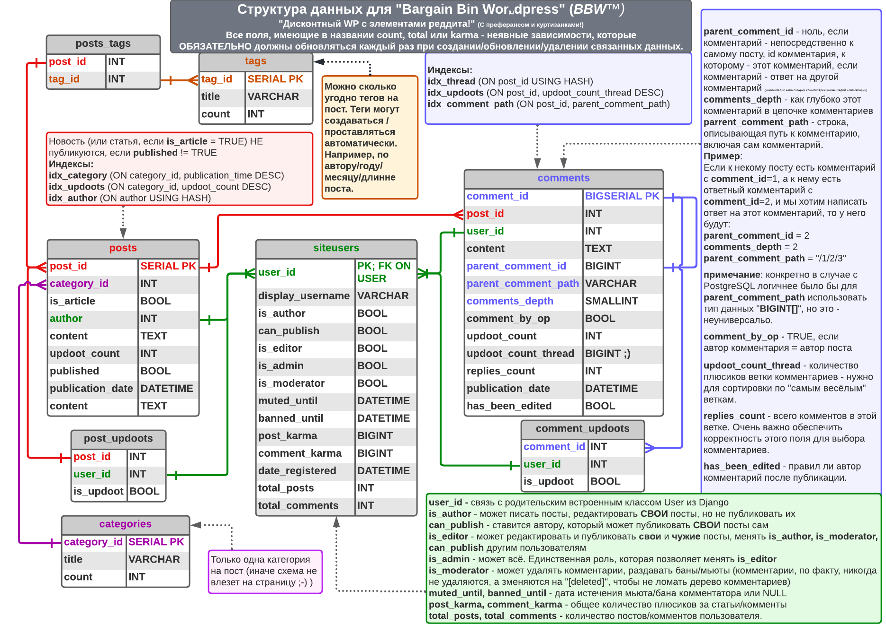

# BBW
#### Так же известный как
### Bargain Bin Worldpress
_Легковесная альтернатива общеизвестному wordpress специально для тех, кто считает, что в wordpress - слишком много функций. 
Или слишком подробная документация. Или слишком много готовых плагинов и шаблонов. Или..._

## Файлы проекта:
- **/BargainBinWordpress/bbw/forms.py** - (новое). Обработчики сигналов для задания. 
- **/BargainBinWorldpress/bbw/management/commands.py** (новое). Рассылка дайджестов за неделю с помощью django-apscheduler.
- **/BargainBinWordpress/bbw/views.py** - (изменено) Добавлен EmailSubscriptionsView для управления подписками
- **/BargainBinWordpress/templates/** - (изменено) Новые шаблоны для почты. post.html теперь принимает is_for_email и добавляет к посту email_header/footer.html.
- **/BargainBinWordpress/bbw/urls.py** - (изменено) Новый URL для подписок 
- **/BargainBinWordpress/bbw/models.py** - (изменено) Новые поля для подписок.
- **/BargainBinWordpress/bbw/templatetags/customfilters.py** - Фильтры\Теги.
- **/BargainBinWordpress/bbw/filters.py** - Фильтры по постам (django_filter)
- **/BargainBinWordpress/bbw/admin.py** - можно править посты/юзеров/категории/теги из админки
- **/BargainBinWordpress/d5.py** - Функции для наполнения базы тестовыми данными.

Использование d5.py:
```commandline
python manage.py shell
```
```python
from d5 import *
```

## Схема Базы Данных:


### Статус имплементации модели:

1. [x] Базовый функционал: Да
2. [ ] Контроль Ролей пользователей: Нет
3. [ ] Древовидные комментарии: Нет
4. [ ] Неанонимные плюсы/минусы/комментарии: Нет
5. [ ] Контроль полей count/total/karma: Нет

### Как должны работать древовидные комментарии

Примечание: далее - отформатированная копипаста моего общения с опытным коллегой.

Я пытаюсь запихнуть небинарное дерево в одну таблицу. 
И, в теории, вроде как даже +- преуспеваю, хотя, возможно и не делаю это самым изящным образом.
Строка `parent_comment_path` - абсолютно критична здесь, единственное, я понял, что для корректной сортировки в неё 
надо вписывать и id самого комментария, а не только путь к нему (что ещё больше денормализует данные, ну и ладно).

Для того чтобы получить reddit-style выборку комментариев 
(20 самых популярных веток, но не больше 5 комментариев в глубину), мне нужно по идее, 2 запроса.

##### Сначала я делаю:

```SQL
SELECT comment_id, replies_count FROM comments 
WHERE post_id = 123 AND comments_depth = 0
ORDER BY updoot_count_thread DESC
LIMIT 20;
```

Я, таким образом, получаю `comment_id` родительских комментариев 20 самых 
популярных веток. (допустим, **456, 567, 678**...)

##### Вторым этапом я делаю:

```SQL
SELECT * FROM comments 
WHERE post_id = 123 AND 
(
  parent_comment_path LIKE '/456%' OR 
  parent_comment_path LIKE '/567%' OR
  parent_comment_path LIKE '/678%' -- и т.д.
)
AND comments_depth <= 4
ORDER BY parent_comment_path ASC;
```

##### В итоге я имею:
1. 20 `id` и `num_replies` для родительских комментариев с наибольшим количеством плюсиков по всей ветке
2. Полное содержание этих комментариев и 4-х уровней ответов к ним, отсортированных **в порядке дерева depth first**.
---
##### Следующий, admittedly, корявый этап - это маппинг 
между первым массивом и конкретным подмножеством строк второго массива, что - несложно, 
так как я знаю num_replies в каждом треде, а второй массив уже отсортирован в порядке дерева. 
В результате я для каждого из элементов первого массива получаю некий `offset`, 
указывающий порядковый номер строки во втором массиве, в котором живёт его коммент.
---
#### Рендеринг же абсолютно не хитрый.
Что-то в духе:
```python
# top_20_comment_threads: list (результат выполнения запроса 1 + значение offset, полученное mapping функцией)
# comments: list (результат выполнения запроса 2)
# render_comment: callable (кусок кода, который выводит, собственно, содержимое коммента)

for top_level_comment in top_20_comment_threads:

    print('<div class="top_level_comment">')
    render_comment(comments[top_level_comment.offset])
    initial_comment_depth = previous_comment_depth = comments[top_level_comment.offset].comments_depth

    for comment in comments[top_level_comment.offset+1:top_level_comment.offset+top_level_comment.replies_count+1]:
        if comment.comments_depth <= previous_comment_depth:
            print('</div>' * (previous_comment_depth - comment.depth + 1))
        previous_comment_depth = comment.comments_depth

        print('div class="nested_comment>')
        render_comment(comment)

    print('</div>' * (comment.depth - initial_comment_depth + 1))
```

- Чтобы загрузить следующую страницу комментариев делаем в первом запросе `OFFSET 20` и дальше повторяем всю процедуру.

- Чтобы загрузить незагруженные уровни комментариев делаем во втором запросе 
`parent_comment_path LIKE '/456/789/1011/1213/1415%' и AND comments_depth <= 9`

---
**Из приятного**, когда после добавление ответа нужно пересчитать количество ответов во всех родительских тредах, 
благодаря полю `parent_comment_path` я могу это сделать без мутных рекурсивных процедур просто сделав в питоне 
`parent_comment_path.split('/')` и обновить записи, `WHERE (comment_id = 123 OR comment_id = 456 и т.д.)` 

То же самое с голосованием.

---
#### Недостатки:

1. Сейчас у меня верхний уровень комментов отсортирован по популярности, но всё что внутри - 
остаётся в хронологическом порядке. Я конечно могу попытаться рекурсивно сортировать каждый следующий 
уровень комментариев в питоне, но это очень дорого. Не знаю, какой тут можно хак применить, чтобы хотя бы 
первый вложенный уровень тоже сортировался по `updoot_count_thread` на выходе из базы.

2. Если предположить, что у нас именно reddit, а не условный сайт с новостями районной управы, то такой подход 
по получению комментариев сосёт[^1], так как я не могу просто сделать `LIMIT 200` во втором запросе.
Мне нужно обязательно получить **все** комментарии, удовлетворяющие критерию, даже если их 5000, 
иначе весь остальной алгоритм не работает.<br>
В качестве костыля можно, например, в таблицу `posts` ставить пометку, что для этого поста нужно делать 
не 20 тредов и 5 уровней, а 10 тредов и 4 уровня, после того, как количество комментариев по исходному запросу 
перевалит за определённый порог. 

3. Хотелось бы избежать mapping функции, связывающей данные из первого и второго запроса, но не знаю как.

---
[^1]: "Сосёт" - уместный в данном случае технический термин ;-)

